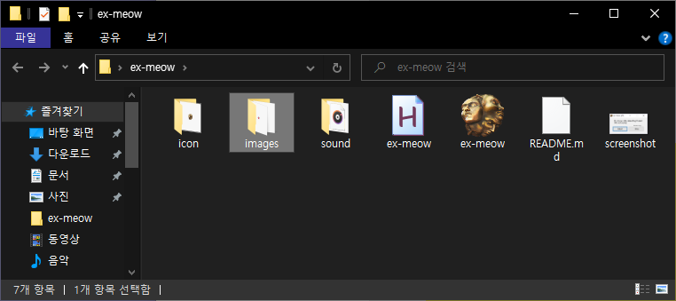

 

## 1. Introduction

`ex-meow` is a program detecting Exalted Orbs on your screen and notifying it by meowing.

- simple and powerful
- scalable: whatever you want to detect, make them detectable.

#### Last updated (2021.02.06)

Initial updated

  

## 2. How to Use

Since `ex-meow` doesn't provide auto-image-scaling, it needs certain images(label on field, mark on map, icon in inventory...) which help detecting Exalted Orbs or something from you.

 

1. Open [Images] file and add images fit your display resolution. **ONLY PNG file format is available.**
2. Excute `ex-meow`.
3. Tap 'Detect' button and hunting Exalted Orbs. When you get one, feel a flush of joy with meow sound.

  

## 3. Demo
[notion.so/macaronpark/ex-meow-demo](https://www.notion.so/macaronpark/ex-meow-demo-2eaf418beaa24c37841e53fbd3760025)

 
